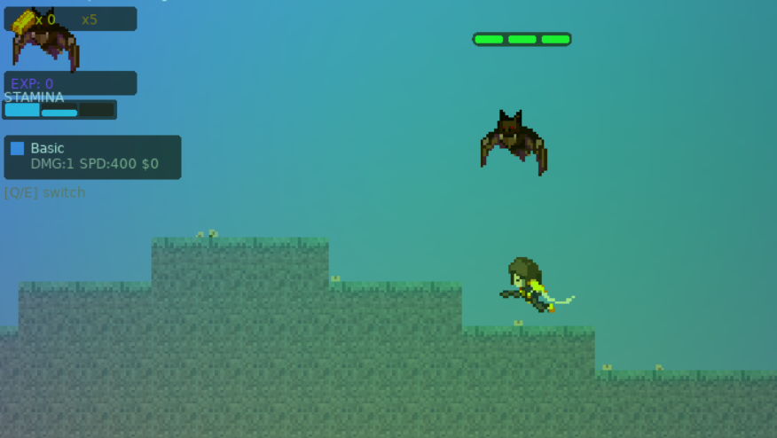
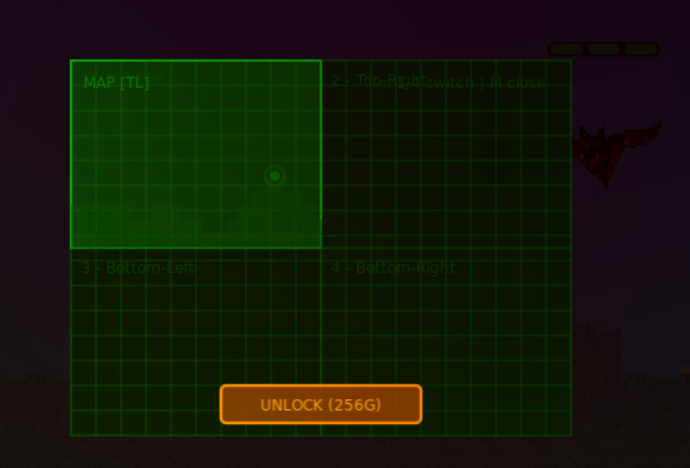
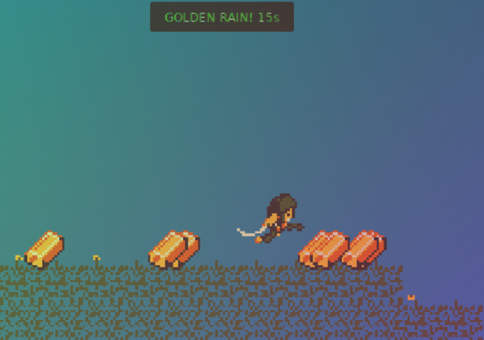

# Welcome-to-Kaliningrad
Game for HSE gamejam in love2d with terraria atmosphere





## Структура

```
├── assets/          # Спрайты
│   ├── s.jpg        # Спрайт-лист тайлов
│   └── lol.png      # Спрайт игрока
├── imp/             # Интерфейс
│   ├── menu.lua     # Главное меню (Play / Settings / Exit)
│   └── gui.lua, api.lua
├── mgf/             # Генерация мира
│   ├── noise.lua    # Perlin noise + octaves
│   ├── terrain.lua  # Генератор чанков, отрисовка
│   ├── main.lua     # Отдельная точка входа
│   └── conf.lua
├── main.lua         # Главная точка входа
└── conf.lua         # Конфигурация Love2D
```

## Управление (игра)

| Клавиша | Действие |
|---------|----------|
| A / ←   | Влево    |
| D / →   | Вправо   |
| W / ↑ / Space | Прыжок (двойной) |
| ESC     | Меню     |
| F5      | Дебаг-инфо (координаты, тайлы) |
| Scroll  | Зум      |

## Мир

- **50×50 тайлов** (800×800 пикселей)
- **3 типа блоков:** трава, земля, камень
- Процедурная генерация через Perlin noise (холмы + пещеры)
- Спавн в точке X=25 на поверхности

## Физика

- Гравитация, ускорение, трение
- Двойной прыжок
- Коллизия с блоками (раздельное разрешение X/Y)

## Интерфейс

- Главное меню с тремя кнопками (Exit перечёркнут)
- Follow-камера (игрок в центре)
- Миникарта 50×50 в правом верхнем углу
  - Зелёный = трава, коричневый = земля, серый = камень
  - Жёлтая точка = игрок
  - Красная рамка = область на экране
- Дебаг-оверлей по F5

## Запуск

```bash
love "D:\ik-all\v\world\f_xyz\aaa\ggg\mmm\home\work\linux\etc\j\c\p"
```

## Спрайт-лист

Тайлы в `assets/s.jpg`, 16×16 пикселей, слева направо:

- #2 — камень
- #3 — земля
- #4 — трава
